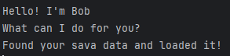

# Bob User Guide



Bob is a task tracker which can track three types of tasks:
1. Todos, which just has the description
2. Deadlines, which store the description and the date it is due
3. Events, which store the description, the date and time the event starts and the date and time the event ends

Users can do the following
1. Add task of various types
2. Delete a task
3. Get a list of all tasks
4. Mark and unmark a task as done
5. Find all tasks which their query substring is within the activity description.
6. Find all deadlines with the same deadline as the query date, and events that fall within the query date
7. Save the list of tasks to a file and load it back on program startup, including ability to recover from corrupted file

# Features

## True DateTime parsing

Bob can do true DateTime parsing, allowing for features such as find by date and possibly more in the future


## Ability to save itself from a corrupted file

Should Bob find it's save file is corrupted, it can re-create it to continue normal execution
# User Guide

`todo (todo description)`

A ToDo with the description is created

```
Got it. I've added this task:
[T][ ] (todo description)
Now you have 1 task in the list.
```

`deadline (deadline description) /by (deadline in yyyy-mm-dd)`

A Deadline with the description and given deadline is created

```
Got it. I've added this task:
[D][ ] (deadline description) (by: (deadline in MMM d yyyy))
Now you have 1 task in the list.
```

`event (event name) /from (start time in yyyy-mm-dd HH:mm) /to (end time in yyyy-mm-dd HH:mm)`

An event with the description, given start and end times is created.

```
Got it. I've added this task:
[E][ ] (event description) (from: (start time in MMM d yyyy h:mma) to: (end time in MMM d yyyy h:mma))
Now you have 1 task in the list.
```
`list`

List all tasks 

```
1.[T][ ] borrow book
2.[D][ ] return book (by: Sept 29 2025)
3.[E][ ] project meeting (from: Sept 29 2025 2:00pm to: Sept 29 2025 4:00pm)
```

`mark (index)`

Mark a task done, based on its index from `list`

```
I've marked the following task as done:
[T][X] borrow book
```

`unmark (index)`

Marks a task as not done, based on its index from `list`

```
I've unmarked the following task as done:
[T][ ] borrow book
```

`delete (index)`

Deletes a task based on its index from `list`

```
Got it. I've deleted this task:
[T][ ] borrow book
Now you have 2 tasks in the list.
```

`find (substring)`

Gets a list of tasks whose description contains the substring queried by user

```
Found these matching tasks!
[T][ ] borrow book
[D][ ] return book (by: Sept 29 2025)
```

`findbydate (date in yyyy-mm-dd)`

Gets a list of deadlines and events. 

For deadlines, if the deadline is on the same day as the user's query, it is shown.

For events, if the user's queried date is between the event's start and end times, it is shown. 

```
The following tasks were found due 2025-09-29
[D][ ] return book (by: Sept 29 2025)
The following events were found within Sept 29 2025
[E][ ] project meeting (from: Sept 29 2025 2:00pm to: Sept 29 2025 4:00pm)
```
